<!-- markdownlint-capture -->
<!-- markdownlint-disable -->

# Code Metrics

This file is dynamically maintained by a bot, *please do not* edit this by hand. It represents various [code metrics](https://aka.ms/dotnet/code-metrics), such as cyclomatic complexity, maintainability index, and so on.

<div id='myjetwallet-dynamiclinkgenerator'></div>

## MyJetWallet.DynamicLinkGenerator :heavy_check_mark:

The *MyJetWallet.DynamicLinkGenerator.csproj* project file contains:

- 5 namespaces.
- 26 named types.
- 426 total lines of source code.
- Approximately 69 lines of executable code.
- The highest cyclomatic complexity is 4 :heavy_check_mark:.

<details>
<summary>
  <strong id="service-pushnotification-domain-models-enums">
    Service.PushNotification.Domain.Models.Enums :heavy_check_mark:
  </strong>
</summary>
<br>

The `Service.PushNotification.Domain.Models.Enums` namespace contains 1 named types.

- 1 named types.
- 9 total lines of source code.
- Approximately 3 lines of executable code.
- The highest cyclomatic complexity is 0 :heavy_check_mark:.

<details>
<summary>
  <strong id="jwaction">
    JwAction :heavy_check_mark:
  </strong>
</summary>
<br>

- The `JwAction` contains 2 members.
- 6 total lines of source code.
- Approximately 3 lines of executable code.
- The highest cyclomatic complexity is 0 :heavy_check_mark:.

| Member kind | Line number | Maintainability index | Cyclomatic complexity | Depth of inheritance | Class coupling | Lines of source / executable code |
| :-: | :-: | :-: | :-: | :-: | :-: | :-: |
| Field | <a href='https://github.com/MyJetWallet/MyJetWallet.DynamicLinkGenerator/blob/master/src/MyJetWallet.DynamicLinkGenerator/Models/JwAction.cs#L9' title='JwAction.jw_operation_history'>9</a> | 93 | 0 :heavy_check_mark: | 0 | 0 | 1 / 1 |
| Field | <a href='https://github.com/MyJetWallet/MyJetWallet.DynamicLinkGenerator/blob/master/src/MyJetWallet.DynamicLinkGenerator/Models/JwAction.cs#L8' title='JwAction.None'>8</a> | 100 | 0 :heavy_check_mark: | 0 | 0 | 1 / 0 |

<a href="#JwAction-class-diagram">:link: to `JwAction` class diagram</a>

<a href="#service-pushnotification-domain-models-enums">:top: back to Service.PushNotification.Domain.Models.Enums</a>

</details>

</details>

<details>
<summary>
  <strong id="myjetwallet-dynamiclinkgenerator-ioc">
    MyJetWallet.DynamicLinkGenerator.Ioc :heavy_check_mark:
  </strong>
</summary>
<br>

The `MyJetWallet.DynamicLinkGenerator.Ioc` namespace contains 1 named types.

- 1 named types.
- 27 total lines of source code.
- Approximately 3 lines of executable code.
- The highest cyclomatic complexity is 1 :heavy_check_mark:.

<details>
<summary>
  <strong id="autofachelper">
    AutofacHelper :heavy_check_mark:
  </strong>
</summary>
<br>

- The `AutofacHelper` contains 2 members.
- 24 total lines of source code.
- Approximately 3 lines of executable code.
- The highest cyclomatic complexity is 1 :heavy_check_mark:.

| Member kind | Line number | Maintainability index | Cyclomatic complexity | Depth of inheritance | Class coupling | Lines of source / executable code |
| :-: | :-: | :-: | :-: | :-: | :-: | :-: |
| Method | <a href='https://github.com/MyJetWallet/MyJetWallet.DynamicLinkGenerator/blob/master/src/MyJetWallet.DynamicLinkGenerator/Ioc/AutofacHelper.cs#L13' title='void AutofacHelper.RegisterDynamicLinkClient(ContainerBuilder builder, IMyNoSqlSubscriber myNoSqlClient)'>13</a> | 87 | 1 :heavy_check_mark: | 0 | 5 | 12 / 2 |
| Method | <a href='https://github.com/MyJetWallet/MyJetWallet.DynamicLinkGenerator/blob/master/src/MyJetWallet.DynamicLinkGenerator/Ioc/AutofacHelper.cs#L26' title='void AutofacHelper.RegisterDynamicLinkSettingsWriter(ContainerBuilder builder, Func<string> myNoSqlWriterUrl)'>26</a> | 93 | 1 :heavy_check_mark: | 0 | 5 | 8 / 1 |

<a href="#AutofacHelper-class-diagram">:link: to `AutofacHelper` class diagram</a>

<a href="#myjetwallet-dynamiclinkgenerator-ioc">:top: back to MyJetWallet.DynamicLinkGenerator.Ioc</a>

</details>

</details>

<details>
<summary>
  <strong id="myjetwallet-dynamiclinkgenerator-models">
    MyJetWallet.DynamicLinkGenerator.Models :heavy_check_mark:
  </strong>
</summary>
<br>

The `MyJetWallet.DynamicLinkGenerator.Models` namespace contains 19 named types.

- 19 named types.
- 164 total lines of source code.
- Approximately 0 lines of executable code.
- The highest cyclomatic complexity is 2 :heavy_check_mark:.

<details>
<summary>
  <strong id="actionenum">
    ActionEnum :heavy_check_mark:
  </strong>
</summary>
<br>

- The `ActionEnum` contains 18 members.
- 21 total lines of source code.
- Approximately 0 lines of executable code.
- The highest cyclomatic complexity is 0 :heavy_check_mark:.

| Member kind | Line number | Maintainability index | Cyclomatic complexity | Depth of inheritance | Class coupling | Lines of source / executable code |
| :-: | :-: | :-: | :-: | :-: | :-: | :-: |
| Field | <a href='https://github.com/MyJetWallet/MyJetWallet.DynamicLinkGenerator/blob/master/src/MyJetWallet.DynamicLinkGenerator/Models/ActionEnum.cs#L7' title='ActionEnum.ConfirmEmail'>7</a> | 100 | 0 :heavy_check_mark: | 0 | 0 | 1 / 0 |
| Field | <a href='https://github.com/MyJetWallet/MyJetWallet.DynamicLinkGenerator/blob/master/src/MyJetWallet.DynamicLinkGenerator/Models/ActionEnum.cs#L10' title='ActionEnum.ConfirmTransfer'>10</a> | 100 | 0 :heavy_check_mark: | 0 | 0 | 1 / 0 |
| Field | <a href='https://github.com/MyJetWallet/MyJetWallet.DynamicLinkGenerator/blob/master/src/MyJetWallet.DynamicLinkGenerator/Models/ActionEnum.cs#L9' title='ActionEnum.ConfirmWithdrawal'>9</a> | 100 | 0 :heavy_check_mark: | 0 | 0 | 1 / 0 |
| Field | <a href='https://github.com/MyJetWallet/MyJetWallet.DynamicLinkGenerator/blob/master/src/MyJetWallet.DynamicLinkGenerator/Models/ActionEnum.cs#L13' title='ActionEnum.DepositStart'>13</a> | 100 | 0 :heavy_check_mark: | 0 | 0 | 1 / 0 |
| Field | <a href='https://github.com/MyJetWallet/MyJetWallet.DynamicLinkGenerator/blob/master/src/MyJetWallet.DynamicLinkGenerator/Models/ActionEnum.cs#L17' title='ActionEnum.EarnLanding'>17</a> | 100 | 0 :heavy_check_mark: | 0 | 0 | 1 / 0 |
| Field | <a href='https://github.com/MyJetWallet/MyJetWallet.DynamicLinkGenerator/blob/master/src/MyJetWallet.DynamicLinkGenerator/Models/ActionEnum.cs#L8' title='ActionEnum.ForgotPassword'>8</a> | 100 | 0 :heavy_check_mark: | 0 | 0 | 1 / 0 |
| Field | <a href='https://github.com/MyJetWallet/MyJetWallet.DynamicLinkGenerator/blob/master/src/MyJetWallet.DynamicLinkGenerator/Models/ActionEnum.cs#L22' title='ActionEnum.HighYield'>22</a> | 100 | 0 :heavy_check_mark: | 0 | 0 | 1 / 0 |
| Field | <a href='https://github.com/MyJetWallet/MyJetWallet.DynamicLinkGenerator/blob/master/src/MyJetWallet.DynamicLinkGenerator/Models/ActionEnum.cs#L11' title='ActionEnum.InviteFriend'>11</a> | 100 | 0 :heavy_check_mark: | 0 | 0 | 1 / 0 |
| Field | <a href='https://github.com/MyJetWallet/MyJetWallet.DynamicLinkGenerator/blob/master/src/MyJetWallet.DynamicLinkGenerator/Models/ActionEnum.cs#L19' title='ActionEnum.KycFail'>19</a> | 100 | 0 :heavy_check_mark: | 0 | 0 | 1 / 0 |
| Field | <a href='https://github.com/MyJetWallet/MyJetWallet.DynamicLinkGenerator/blob/master/src/MyJetWallet.DynamicLinkGenerator/Models/ActionEnum.cs#L18' title='ActionEnum.KycSuccess'>18</a> | 100 | 0 :heavy_check_mark: | 0 | 0 | 1 / 0 |
| Field | <a href='https://github.com/MyJetWallet/MyJetWallet.DynamicLinkGenerator/blob/master/src/MyJetWallet.DynamicLinkGenerator/Models/ActionEnum.cs#L12' title='ActionEnum.KycVerification'>12</a> | 100 | 0 :heavy_check_mark: | 0 | 0 | 1 / 0 |
| Field | <a href='https://github.com/MyJetWallet/MyJetWallet.DynamicLinkGenerator/blob/master/src/MyJetWallet.DynamicLinkGenerator/Models/ActionEnum.cs#L6' title='ActionEnum.Login'>6</a> | 100 | 0 :heavy_check_mark: | 0 | 0 | 1 / 0 |
| Field | <a href='https://github.com/MyJetWallet/MyJetWallet.DynamicLinkGenerator/blob/master/src/MyJetWallet.DynamicLinkGenerator/Models/ActionEnum.cs#L5' title='ActionEnum.None'>5</a> | 100 | 0 :heavy_check_mark: | 0 | 0 | 1 / 0 |
| Field | <a href='https://github.com/MyJetWallet/MyJetWallet.DynamicLinkGenerator/blob/master/src/MyJetWallet.DynamicLinkGenerator/Models/ActionEnum.cs#L21' title='ActionEnum.ProfileDelete'>21</a> | 100 | 0 :heavy_check_mark: | 0 | 0 | 1 / 0 |
| Field | <a href='https://github.com/MyJetWallet/MyJetWallet.DynamicLinkGenerator/blob/master/src/MyJetWallet.DynamicLinkGenerator/Models/ActionEnum.cs#L20' title='ActionEnum.RecurringBuyStart'>20</a> | 100 | 0 :heavy_check_mark: | 0 | 0 | 1 / 0 |
| Field | <a href='https://github.com/MyJetWallet/MyJetWallet.DynamicLinkGenerator/blob/master/src/MyJetWallet.DynamicLinkGenerator/Models/ActionEnum.cs#L14' title='ActionEnum.TradingStart'>14</a> | 100 | 0 :heavy_check_mark: | 0 | 0 | 1 / 0 |
| Field | <a href='https://github.com/MyJetWallet/MyJetWallet.DynamicLinkGenerator/blob/master/src/MyJetWallet.DynamicLinkGenerator/Models/ActionEnum.cs#L16' title='ActionEnum.VerifyTransfer'>16</a> | 100 | 0 :heavy_check_mark: | 0 | 0 | 1 / 0 |
| Field | <a href='https://github.com/MyJetWallet/MyJetWallet.DynamicLinkGenerator/blob/master/src/MyJetWallet.DynamicLinkGenerator/Models/ActionEnum.cs#L15' title='ActionEnum.VerifyWithdrawal'>15</a> | 100 | 0 :heavy_check_mark: | 0 | 0 | 1 / 0 |

<a href="#ActionEnum-class-diagram">:link: to `ActionEnum` class diagram</a>

<a href="#myjetwallet-dynamiclinkgenerator-models">:top: back to MyJetWallet.DynamicLinkGenerator.Models</a>

</details>

<details>
<summary>
  <strong id="devicetypeenum">
    DeviceTypeEnum :heavy_check_mark:
  </strong>
</summary>
<br>

- The `DeviceTypeEnum` contains 3 members.
- 6 total lines of source code.
- Approximately 0 lines of executable code.
- The highest cyclomatic complexity is 0 :heavy_check_mark:.

| Member kind | Line number | Maintainability index | Cyclomatic complexity | Depth of inheritance | Class coupling | Lines of source / executable code |
| :-: | :-: | :-: | :-: | :-: | :-: | :-: |
| Field | <a href='https://github.com/MyJetWallet/MyJetWallet.DynamicLinkGenerator/blob/master/src/MyJetWallet.DynamicLinkGenerator/Models/DeviceTypeEnum.cs#L5' title='DeviceTypeEnum.Android'>5</a> | 100 | 0 :heavy_check_mark: | 0 | 0 | 1 / 0 |
| Field | <a href='https://github.com/MyJetWallet/MyJetWallet.DynamicLinkGenerator/blob/master/src/MyJetWallet.DynamicLinkGenerator/Models/DeviceTypeEnum.cs#L6' title='DeviceTypeEnum.Ios'>6</a> | 100 | 0 :heavy_check_mark: | 0 | 0 | 1 / 0 |
| Field | <a href='https://github.com/MyJetWallet/MyJetWallet.DynamicLinkGenerator/blob/master/src/MyJetWallet.DynamicLinkGenerator/Models/DeviceTypeEnum.cs#L7' title='DeviceTypeEnum.Unknown'>7</a> | 100 | 0 :heavy_check_mark: | 0 | 0 | 1 / 0 |

<a href="#DeviceTypeEnum-class-diagram">:link: to `DeviceTypeEnum` class diagram</a>

<a href="#myjetwallet-dynamiclinkgenerator-models">:top: back to MyJetWallet.DynamicLinkGenerator.Models</a>

</details>

<details>
<summary>
  <strong id="generateconfirmemaillinkrequest">
    GenerateConfirmEmailLinkRequest :heavy_check_mark:
  </strong>
</summary>
<br>

- The `GenerateConfirmEmailLinkRequest` contains 4 members.
- 7 total lines of source code.
- Approximately 0 lines of executable code.
- The highest cyclomatic complexity is 2 :heavy_check_mark:.

| Member kind | Line number | Maintainability index | Cyclomatic complexity | Depth of inheritance | Class coupling | Lines of source / executable code |
| :-: | :-: | :-: | :-: | :-: | :-: | :-: |
| Property | <a href='https://github.com/MyJetWallet/MyJetWallet.DynamicLinkGenerator/blob/master/src/MyJetWallet.DynamicLinkGenerator/Models/GenerateConfirmEmailLinkRequest.cs#L5' title='string GenerateConfirmEmailLinkRequest.Brand'>5</a> | 100 | 2 :heavy_check_mark: | 0 | 0 | 1 / 0 |
| Property | <a href='https://github.com/MyJetWallet/MyJetWallet.DynamicLinkGenerator/blob/master/src/MyJetWallet.DynamicLinkGenerator/Models/GenerateConfirmEmailLinkRequest.cs#L7' title='string GenerateConfirmEmailLinkRequest.Code'>7</a> | 100 | 2 :heavy_check_mark: | 0 | 0 | 1 / 0 |
| Property | <a href='https://github.com/MyJetWallet/MyJetWallet.DynamicLinkGenerator/blob/master/src/MyJetWallet.DynamicLinkGenerator/Models/GenerateConfirmEmailLinkRequest.cs#L6' title='DeviceTypeEnum GenerateConfirmEmailLinkRequest.DeviceType'>6</a> | 100 | 2 :heavy_check_mark: | 0 | 1 | 1 / 0 |
| Property | <a href='https://github.com/MyJetWallet/MyJetWallet.DynamicLinkGenerator/blob/master/src/MyJetWallet.DynamicLinkGenerator/Models/GenerateConfirmEmailLinkRequest.cs#L8' title='string GenerateConfirmEmailLinkRequest.Token'>8</a> | 100 | 2 :heavy_check_mark: | 0 | 0 | 1 / 0 |

<a href="#GenerateConfirmEmailLinkRequest-class-diagram">:link: to `GenerateConfirmEmailLinkRequest` class diagram</a>

<a href="#myjetwallet-dynamiclinkgenerator-models">:top: back to MyJetWallet.DynamicLinkGenerator.Models</a>

</details>

<details>
<summary>
  <strong id="generatedeleteprofilelinkrequest">
    GenerateDeleteProfileLinkRequest :heavy_check_mark:
  </strong>
</summary>
<br>

- The `GenerateDeleteProfileLinkRequest` contains 3 members.
- 6 total lines of source code.
- Approximately 0 lines of executable code.
- The highest cyclomatic complexity is 2 :heavy_check_mark:.

| Member kind | Line number | Maintainability index | Cyclomatic complexity | Depth of inheritance | Class coupling | Lines of source / executable code |
| :-: | :-: | :-: | :-: | :-: | :-: | :-: |
| Property | <a href='https://github.com/MyJetWallet/MyJetWallet.DynamicLinkGenerator/blob/master/src/MyJetWallet.DynamicLinkGenerator/Models/GenerateDeleteProfileLinkRequest.cs#L5' title='string GenerateDeleteProfileLinkRequest.Brand'>5</a> | 100 | 2 :heavy_check_mark: | 0 | 0 | 1 / 0 |
| Property | <a href='https://github.com/MyJetWallet/MyJetWallet.DynamicLinkGenerator/blob/master/src/MyJetWallet.DynamicLinkGenerator/Models/GenerateDeleteProfileLinkRequest.cs#L7' title='string GenerateDeleteProfileLinkRequest.Code'>7</a> | 100 | 2 :heavy_check_mark: | 0 | 0 | 1 / 0 |
| Property | <a href='https://github.com/MyJetWallet/MyJetWallet.DynamicLinkGenerator/blob/master/src/MyJetWallet.DynamicLinkGenerator/Models/GenerateDeleteProfileLinkRequest.cs#L6' title='DeviceTypeEnum GenerateDeleteProfileLinkRequest.DeviceType'>6</a> | 100 | 2 :heavy_check_mark: | 0 | 1 | 1 / 0 |

<a href="#GenerateDeleteProfileLinkRequest-class-diagram">:link: to `GenerateDeleteProfileLinkRequest` class diagram</a>

<a href="#myjetwallet-dynamiclinkgenerator-models">:top: back to MyJetWallet.DynamicLinkGenerator.Models</a>

</details>

<details>
<summary>
  <strong id="generatedepositstartlinkrequest">
    GenerateDepositStartLinkRequest :heavy_check_mark:
  </strong>
</summary>
<br>

- The `GenerateDepositStartLinkRequest` contains 2 members.
- 5 total lines of source code.
- Approximately 0 lines of executable code.
- The highest cyclomatic complexity is 2 :heavy_check_mark:.

| Member kind | Line number | Maintainability index | Cyclomatic complexity | Depth of inheritance | Class coupling | Lines of source / executable code |
| :-: | :-: | :-: | :-: | :-: | :-: | :-: |
| Property | <a href='https://github.com/MyJetWallet/MyJetWallet.DynamicLinkGenerator/blob/master/src/MyJetWallet.DynamicLinkGenerator/Models/GenerateDepositStartLinkRequest.cs#L5' title='string GenerateDepositStartLinkRequest.Brand'>5</a> | 100 | 2 :heavy_check_mark: | 0 | 0 | 1 / 0 |
| Property | <a href='https://github.com/MyJetWallet/MyJetWallet.DynamicLinkGenerator/blob/master/src/MyJetWallet.DynamicLinkGenerator/Models/GenerateDepositStartLinkRequest.cs#L6' title='DeviceTypeEnum GenerateDepositStartLinkRequest.DeviceType'>6</a> | 100 | 2 :heavy_check_mark: | 0 | 1 | 1 / 0 |

<a href="#GenerateDepositStartLinkRequest-class-diagram">:link: to `GenerateDepositStartLinkRequest` class diagram</a>

<a href="#myjetwallet-dynamiclinkgenerator-models">:top: back to MyJetWallet.DynamicLinkGenerator.Models</a>

</details>

<details>
<summary>
  <strong id="generateearnlandinglinkrequest">
    GenerateEarnLandingLinkRequest :heavy_check_mark:
  </strong>
</summary>
<br>

- The `GenerateEarnLandingLinkRequest` contains 2 members.
- 5 total lines of source code.
- Approximately 0 lines of executable code.
- The highest cyclomatic complexity is 2 :heavy_check_mark:.

| Member kind | Line number | Maintainability index | Cyclomatic complexity | Depth of inheritance | Class coupling | Lines of source / executable code |
| :-: | :-: | :-: | :-: | :-: | :-: | :-: |
| Property | <a href='https://github.com/MyJetWallet/MyJetWallet.DynamicLinkGenerator/blob/master/src/MyJetWallet.DynamicLinkGenerator/Models/GenerateEarnLandingLinkRequest.cs#L5' title='string GenerateEarnLandingLinkRequest.Brand'>5</a> | 100 | 2 :heavy_check_mark: | 0 | 0 | 1 / 0 |
| Property | <a href='https://github.com/MyJetWallet/MyJetWallet.DynamicLinkGenerator/blob/master/src/MyJetWallet.DynamicLinkGenerator/Models/GenerateEarnLandingLinkRequest.cs#L6' title='DeviceTypeEnum GenerateEarnLandingLinkRequest.DeviceType'>6</a> | 100 | 2 :heavy_check_mark: | 0 | 1 | 1 / 0 |

<a href="#GenerateEarnLandingLinkRequest-class-diagram">:link: to `GenerateEarnLandingLinkRequest` class diagram</a>

<a href="#myjetwallet-dynamiclinkgenerator-models">:top: back to MyJetWallet.DynamicLinkGenerator.Models</a>

</details>

<details>
<summary>
  <strong id="generateforgotpasswordlinkrequest">
    GenerateForgotPasswordLinkRequest :heavy_check_mark:
  </strong>
</summary>
<br>

- The `GenerateForgotPasswordLinkRequest` contains 4 members.
- 7 total lines of source code.
- Approximately 0 lines of executable code.
- The highest cyclomatic complexity is 2 :heavy_check_mark:.

| Member kind | Line number | Maintainability index | Cyclomatic complexity | Depth of inheritance | Class coupling | Lines of source / executable code |
| :-: | :-: | :-: | :-: | :-: | :-: | :-: |
| Property | <a href='https://github.com/MyJetWallet/MyJetWallet.DynamicLinkGenerator/blob/master/src/MyJetWallet.DynamicLinkGenerator/Models/GenerateForgotPasswordLinkRequest.cs#L5' title='string GenerateForgotPasswordLinkRequest.Brand'>5</a> | 100 | 2 :heavy_check_mark: | 0 | 0 | 1 / 0 |
| Property | <a href='https://github.com/MyJetWallet/MyJetWallet.DynamicLinkGenerator/blob/master/src/MyJetWallet.DynamicLinkGenerator/Models/GenerateForgotPasswordLinkRequest.cs#L8' title='string GenerateForgotPasswordLinkRequest.Code'>8</a> | 100 | 2 :heavy_check_mark: | 0 | 0 | 1 / 0 |
| Property | <a href='https://github.com/MyJetWallet/MyJetWallet.DynamicLinkGenerator/blob/master/src/MyJetWallet.DynamicLinkGenerator/Models/GenerateForgotPasswordLinkRequest.cs#L6' title='DeviceTypeEnum GenerateForgotPasswordLinkRequest.DeviceType'>6</a> | 100 | 2 :heavy_check_mark: | 0 | 1 | 1 / 0 |
| Property | <a href='https://github.com/MyJetWallet/MyJetWallet.DynamicLinkGenerator/blob/master/src/MyJetWallet.DynamicLinkGenerator/Models/GenerateForgotPasswordLinkRequest.cs#L7' title='string GenerateForgotPasswordLinkRequest.Token'>7</a> | 100 | 2 :heavy_check_mark: | 0 | 0 | 1 / 0 |

<a href="#GenerateForgotPasswordLinkRequest-class-diagram">:link: to `GenerateForgotPasswordLinkRequest` class diagram</a>

<a href="#myjetwallet-dynamiclinkgenerator-models">:top: back to MyJetWallet.DynamicLinkGenerator.Models</a>

</details>

<details>
<summary>
  <strong id="generatehighyieldlinkrequest">
    GenerateHighYieldLinkRequest :heavy_check_mark:
  </strong>
</summary>
<br>

- The `GenerateHighYieldLinkRequest` contains 2 members.
- 5 total lines of source code.
- Approximately 0 lines of executable code.
- The highest cyclomatic complexity is 2 :heavy_check_mark:.

| Member kind | Line number | Maintainability index | Cyclomatic complexity | Depth of inheritance | Class coupling | Lines of source / executable code |
| :-: | :-: | :-: | :-: | :-: | :-: | :-: |
| Property | <a href='https://github.com/MyJetWallet/MyJetWallet.DynamicLinkGenerator/blob/master/src/MyJetWallet.DynamicLinkGenerator/Models/GenerateHighYieldLinkRequest.cs#L5' title='string GenerateHighYieldLinkRequest.Brand'>5</a> | 100 | 2 :heavy_check_mark: | 0 | 0 | 1 / 0 |
| Property | <a href='https://github.com/MyJetWallet/MyJetWallet.DynamicLinkGenerator/blob/master/src/MyJetWallet.DynamicLinkGenerator/Models/GenerateHighYieldLinkRequest.cs#L6' title='DeviceTypeEnum GenerateHighYieldLinkRequest.DeviceType'>6</a> | 100 | 2 :heavy_check_mark: | 0 | 1 | 1 / 0 |

<a href="#GenerateHighYieldLinkRequest-class-diagram">:link: to `GenerateHighYieldLinkRequest` class diagram</a>

<a href="#myjetwallet-dynamiclinkgenerator-models">:top: back to MyJetWallet.DynamicLinkGenerator.Models</a>

</details>

<details>
<summary>
  <strong id="generateinvitefriendlinkrequest">
    GenerateInviteFriendLinkRequest :heavy_check_mark:
  </strong>
</summary>
<br>

- The `GenerateInviteFriendLinkRequest` contains 2 members.
- 5 total lines of source code.
- Approximately 0 lines of executable code.
- The highest cyclomatic complexity is 2 :heavy_check_mark:.

| Member kind | Line number | Maintainability index | Cyclomatic complexity | Depth of inheritance | Class coupling | Lines of source / executable code |
| :-: | :-: | :-: | :-: | :-: | :-: | :-: |
| Property | <a href='https://github.com/MyJetWallet/MyJetWallet.DynamicLinkGenerator/blob/master/src/MyJetWallet.DynamicLinkGenerator/Models/GenerateInviteFriendLinkRequest.cs#L5' title='string GenerateInviteFriendLinkRequest.Brand'>5</a> | 100 | 2 :heavy_check_mark: | 0 | 0 | 1 / 0 |
| Property | <a href='https://github.com/MyJetWallet/MyJetWallet.DynamicLinkGenerator/blob/master/src/MyJetWallet.DynamicLinkGenerator/Models/GenerateInviteFriendLinkRequest.cs#L6' title='DeviceTypeEnum GenerateInviteFriendLinkRequest.DeviceType'>6</a> | 100 | 2 :heavy_check_mark: | 0 | 1 | 1 / 0 |

<a href="#GenerateInviteFriendLinkRequest-class-diagram">:link: to `GenerateInviteFriendLinkRequest` class diagram</a>

<a href="#myjetwallet-dynamiclinkgenerator-models">:top: back to MyJetWallet.DynamicLinkGenerator.Models</a>

</details>

<details>
<summary>
  <strong id="generatekycfaillinkrequest">
    GenerateKycFailLinkRequest :heavy_check_mark:
  </strong>
</summary>
<br>

- The `GenerateKycFailLinkRequest` contains 2 members.
- 5 total lines of source code.
- Approximately 0 lines of executable code.
- The highest cyclomatic complexity is 2 :heavy_check_mark:.

| Member kind | Line number | Maintainability index | Cyclomatic complexity | Depth of inheritance | Class coupling | Lines of source / executable code |
| :-: | :-: | :-: | :-: | :-: | :-: | :-: |
| Property | <a href='https://github.com/MyJetWallet/MyJetWallet.DynamicLinkGenerator/blob/master/src/MyJetWallet.DynamicLinkGenerator/Models/GenerateKycFailLinkRequest.cs#L5' title='string GenerateKycFailLinkRequest.Brand'>5</a> | 100 | 2 :heavy_check_mark: | 0 | 0 | 1 / 0 |
| Property | <a href='https://github.com/MyJetWallet/MyJetWallet.DynamicLinkGenerator/blob/master/src/MyJetWallet.DynamicLinkGenerator/Models/GenerateKycFailLinkRequest.cs#L6' title='DeviceTypeEnum GenerateKycFailLinkRequest.DeviceType'>6</a> | 100 | 2 :heavy_check_mark: | 0 | 1 | 1 / 0 |

<a href="#GenerateKycFailLinkRequest-class-diagram">:link: to `GenerateKycFailLinkRequest` class diagram</a>

<a href="#myjetwallet-dynamiclinkgenerator-models">:top: back to MyJetWallet.DynamicLinkGenerator.Models</a>

</details>

<details>
<summary>
  <strong id="generatekycsuccesslinkrequest">
    GenerateKycSuccessLinkRequest :heavy_check_mark:
  </strong>
</summary>
<br>

- The `GenerateKycSuccessLinkRequest` contains 2 members.
- 5 total lines of source code.
- Approximately 0 lines of executable code.
- The highest cyclomatic complexity is 2 :heavy_check_mark:.

| Member kind | Line number | Maintainability index | Cyclomatic complexity | Depth of inheritance | Class coupling | Lines of source / executable code |
| :-: | :-: | :-: | :-: | :-: | :-: | :-: |
| Property | <a href='https://github.com/MyJetWallet/MyJetWallet.DynamicLinkGenerator/blob/master/src/MyJetWallet.DynamicLinkGenerator/Models/GenerateKycSuccessLinkRequest.cs#L5' title='string GenerateKycSuccessLinkRequest.Brand'>5</a> | 100 | 2 :heavy_check_mark: | 0 | 0 | 1 / 0 |
| Property | <a href='https://github.com/MyJetWallet/MyJetWallet.DynamicLinkGenerator/blob/master/src/MyJetWallet.DynamicLinkGenerator/Models/GenerateKycSuccessLinkRequest.cs#L6' title='DeviceTypeEnum GenerateKycSuccessLinkRequest.DeviceType'>6</a> | 100 | 2 :heavy_check_mark: | 0 | 1 | 1 / 0 |

<a href="#GenerateKycSuccessLinkRequest-class-diagram">:link: to `GenerateKycSuccessLinkRequest` class diagram</a>

<a href="#myjetwallet-dynamiclinkgenerator-models">:top: back to MyJetWallet.DynamicLinkGenerator.Models</a>

</details>

<details>
<summary>
  <strong id="generatekycverificationlinkrequest">
    GenerateKycVerificationLinkRequest :heavy_check_mark:
  </strong>
</summary>
<br>

- The `GenerateKycVerificationLinkRequest` contains 2 members.
- 5 total lines of source code.
- Approximately 0 lines of executable code.
- The highest cyclomatic complexity is 2 :heavy_check_mark:.

| Member kind | Line number | Maintainability index | Cyclomatic complexity | Depth of inheritance | Class coupling | Lines of source / executable code |
| :-: | :-: | :-: | :-: | :-: | :-: | :-: |
| Property | <a href='https://github.com/MyJetWallet/MyJetWallet.DynamicLinkGenerator/blob/master/src/MyJetWallet.DynamicLinkGenerator/Models/GenerateKycVerificationLinkRequest.cs#L5' title='string GenerateKycVerificationLinkRequest.Brand'>5</a> | 100 | 2 :heavy_check_mark: | 0 | 0 | 1 / 0 |
| Property | <a href='https://github.com/MyJetWallet/MyJetWallet.DynamicLinkGenerator/blob/master/src/MyJetWallet.DynamicLinkGenerator/Models/GenerateKycVerificationLinkRequest.cs#L6' title='DeviceTypeEnum GenerateKycVerificationLinkRequest.DeviceType'>6</a> | 100 | 2 :heavy_check_mark: | 0 | 1 | 1 / 0 |

<a href="#GenerateKycVerificationLinkRequest-class-diagram">:link: to `GenerateKycVerificationLinkRequest` class diagram</a>

<a href="#myjetwallet-dynamiclinkgenerator-models">:top: back to MyJetWallet.DynamicLinkGenerator.Models</a>

</details>

<details>
<summary>
  <strong id="generateloginlinkrequest">
    GenerateLoginLinkRequest :heavy_check_mark:
  </strong>
</summary>
<br>

- The `GenerateLoginLinkRequest` contains 3 members.
- 6 total lines of source code.
- Approximately 0 lines of executable code.
- The highest cyclomatic complexity is 2 :heavy_check_mark:.

| Member kind | Line number | Maintainability index | Cyclomatic complexity | Depth of inheritance | Class coupling | Lines of source / executable code |
| :-: | :-: | :-: | :-: | :-: | :-: | :-: |
| Property | <a href='https://github.com/MyJetWallet/MyJetWallet.DynamicLinkGenerator/blob/master/src/MyJetWallet.DynamicLinkGenerator/Models/GenerateLoginLinkRequest.cs#L5' title='string GenerateLoginLinkRequest.Brand'>5</a> | 100 | 2 :heavy_check_mark: | 0 | 0 | 1 / 0 |
| Property | <a href='https://github.com/MyJetWallet/MyJetWallet.DynamicLinkGenerator/blob/master/src/MyJetWallet.DynamicLinkGenerator/Models/GenerateLoginLinkRequest.cs#L6' title='DeviceTypeEnum GenerateLoginLinkRequest.DeviceType'>6</a> | 100 | 2 :heavy_check_mark: | 0 | 1 | 1 / 0 |
| Property | <a href='https://github.com/MyJetWallet/MyJetWallet.DynamicLinkGenerator/blob/master/src/MyJetWallet.DynamicLinkGenerator/Models/GenerateLoginLinkRequest.cs#L7' title='string GenerateLoginLinkRequest.Email'>7</a> | 100 | 2 :heavy_check_mark: | 0 | 0 | 1 / 0 |

<a href="#GenerateLoginLinkRequest-class-diagram">:link: to `GenerateLoginLinkRequest` class diagram</a>

<a href="#myjetwallet-dynamiclinkgenerator-models">:top: back to MyJetWallet.DynamicLinkGenerator.Models</a>

</details>

<details>
<summary>
  <strong id="generaterecurringbuylinkrequest">
    GenerateRecurringBuyLinkRequest :heavy_check_mark:
  </strong>
</summary>
<br>

- The `GenerateRecurringBuyLinkRequest` contains 2 members.
- 5 total lines of source code.
- Approximately 0 lines of executable code.
- The highest cyclomatic complexity is 2 :heavy_check_mark:.

| Member kind | Line number | Maintainability index | Cyclomatic complexity | Depth of inheritance | Class coupling | Lines of source / executable code |
| :-: | :-: | :-: | :-: | :-: | :-: | :-: |
| Property | <a href='https://github.com/MyJetWallet/MyJetWallet.DynamicLinkGenerator/blob/master/src/MyJetWallet.DynamicLinkGenerator/Models/GenerateRecurringBuyLinkRequest.cs#L5' title='string GenerateRecurringBuyLinkRequest.Brand'>5</a> | 100 | 2 :heavy_check_mark: | 0 | 0 | 1 / 0 |
| Property | <a href='https://github.com/MyJetWallet/MyJetWallet.DynamicLinkGenerator/blob/master/src/MyJetWallet.DynamicLinkGenerator/Models/GenerateRecurringBuyLinkRequest.cs#L6' title='DeviceTypeEnum GenerateRecurringBuyLinkRequest.DeviceType'>6</a> | 100 | 2 :heavy_check_mark: | 0 | 1 | 1 / 0 |

<a href="#GenerateRecurringBuyLinkRequest-class-diagram">:link: to `GenerateRecurringBuyLinkRequest` class diagram</a>

<a href="#myjetwallet-dynamiclinkgenerator-models">:top: back to MyJetWallet.DynamicLinkGenerator.Models</a>

</details>

<details>
<summary>
  <strong id="generatetradingstartlinkrequest">
    GenerateTradingStartLinkRequest :heavy_check_mark:
  </strong>
</summary>
<br>

- The `GenerateTradingStartLinkRequest` contains 2 members.
- 5 total lines of source code.
- Approximately 0 lines of executable code.
- The highest cyclomatic complexity is 2 :heavy_check_mark:.

| Member kind | Line number | Maintainability index | Cyclomatic complexity | Depth of inheritance | Class coupling | Lines of source / executable code |
| :-: | :-: | :-: | :-: | :-: | :-: | :-: |
| Property | <a href='https://github.com/MyJetWallet/MyJetWallet.DynamicLinkGenerator/blob/master/src/MyJetWallet.DynamicLinkGenerator/Models/GenerateTradingStartLinkRequest.cs#L5' title='string GenerateTradingStartLinkRequest.Brand'>5</a> | 100 | 2 :heavy_check_mark: | 0 | 0 | 1 / 0 |
| Property | <a href='https://github.com/MyJetWallet/MyJetWallet.DynamicLinkGenerator/blob/master/src/MyJetWallet.DynamicLinkGenerator/Models/GenerateTradingStartLinkRequest.cs#L6' title='DeviceTypeEnum GenerateTradingStartLinkRequest.DeviceType'>6</a> | 100 | 2 :heavy_check_mark: | 0 | 1 | 1 / 0 |

<a href="#GenerateTradingStartLinkRequest-class-diagram">:link: to `GenerateTradingStartLinkRequest` class diagram</a>

<a href="#myjetwallet-dynamiclinkgenerator-models">:top: back to MyJetWallet.DynamicLinkGenerator.Models</a>

</details>

<details>
<summary>
  <strong id="generatetransferlinkrequest">
    GenerateTransferLinkRequest :heavy_check_mark:
  </strong>
</summary>
<br>

- The `GenerateTransferLinkRequest` contains 4 members.
- 7 total lines of source code.
- Approximately 0 lines of executable code.
- The highest cyclomatic complexity is 2 :heavy_check_mark:.

| Member kind | Line number | Maintainability index | Cyclomatic complexity | Depth of inheritance | Class coupling | Lines of source / executable code |
| :-: | :-: | :-: | :-: | :-: | :-: | :-: |
| Property | <a href='https://github.com/MyJetWallet/MyJetWallet.DynamicLinkGenerator/blob/master/src/MyJetWallet.DynamicLinkGenerator/Models/GenerateTransferLinkRequest.cs#L5' title='string GenerateTransferLinkRequest.Brand'>5</a> | 100 | 2 :heavy_check_mark: | 0 | 0 | 1 / 0 |
| Property | <a href='https://github.com/MyJetWallet/MyJetWallet.DynamicLinkGenerator/blob/master/src/MyJetWallet.DynamicLinkGenerator/Models/GenerateTransferLinkRequest.cs#L6' title='DeviceTypeEnum GenerateTransferLinkRequest.DeviceType'>6</a> | 100 | 2 :heavy_check_mark: | 0 | 1 | 1 / 0 |
| Property | <a href='https://github.com/MyJetWallet/MyJetWallet.DynamicLinkGenerator/blob/master/src/MyJetWallet.DynamicLinkGenerator/Models/GenerateTransferLinkRequest.cs#L8' title='string GenerateTransferLinkRequest.ErrorCode'>8</a> | 100 | 2 :heavy_check_mark: | 0 | 0 | 1 / 0 |
| Property | <a href='https://github.com/MyJetWallet/MyJetWallet.DynamicLinkGenerator/blob/master/src/MyJetWallet.DynamicLinkGenerator/Models/GenerateTransferLinkRequest.cs#L7' title='string GenerateTransferLinkRequest.OperationId'>7</a> | 100 | 2 :heavy_check_mark: | 0 | 0 | 1 / 0 |

<a href="#GenerateTransferLinkRequest-class-diagram">:link: to `GenerateTransferLinkRequest` class diagram</a>

<a href="#myjetwallet-dynamiclinkgenerator-models">:top: back to MyJetWallet.DynamicLinkGenerator.Models</a>

</details>

<details>
<summary>
  <strong id="generateverifytransferlinkrequest">
    GenerateVerifyTransferLinkRequest :heavy_check_mark:
  </strong>
</summary>
<br>

- The `GenerateVerifyTransferLinkRequest` contains 4 members.
- 7 total lines of source code.
- Approximately 0 lines of executable code.
- The highest cyclomatic complexity is 2 :heavy_check_mark:.

| Member kind | Line number | Maintainability index | Cyclomatic complexity | Depth of inheritance | Class coupling | Lines of source / executable code |
| :-: | :-: | :-: | :-: | :-: | :-: | :-: |
| Property | <a href='https://github.com/MyJetWallet/MyJetWallet.DynamicLinkGenerator/blob/master/src/MyJetWallet.DynamicLinkGenerator/Models/GenerateVerifyTransferLinkRequest.cs#L5' title='string GenerateVerifyTransferLinkRequest.Brand'>5</a> | 100 | 2 :heavy_check_mark: | 0 | 0 | 1 / 0 |
| Property | <a href='https://github.com/MyJetWallet/MyJetWallet.DynamicLinkGenerator/blob/master/src/MyJetWallet.DynamicLinkGenerator/Models/GenerateVerifyTransferLinkRequest.cs#L8' title='string GenerateVerifyTransferLinkRequest.Code'>8</a> | 100 | 2 :heavy_check_mark: | 0 | 0 | 1 / 0 |
| Property | <a href='https://github.com/MyJetWallet/MyJetWallet.DynamicLinkGenerator/blob/master/src/MyJetWallet.DynamicLinkGenerator/Models/GenerateVerifyTransferLinkRequest.cs#L6' title='DeviceTypeEnum GenerateVerifyTransferLinkRequest.DeviceType'>6</a> | 100 | 2 :heavy_check_mark: | 0 | 1 | 1 / 0 |
| Property | <a href='https://github.com/MyJetWallet/MyJetWallet.DynamicLinkGenerator/blob/master/src/MyJetWallet.DynamicLinkGenerator/Models/GenerateVerifyTransferLinkRequest.cs#L7' title='string GenerateVerifyTransferLinkRequest.OperationId'>7</a> | 100 | 2 :heavy_check_mark: | 0 | 0 | 1 / 0 |

<a href="#GenerateVerifyTransferLinkRequest-class-diagram">:link: to `GenerateVerifyTransferLinkRequest` class diagram</a>

<a href="#myjetwallet-dynamiclinkgenerator-models">:top: back to MyJetWallet.DynamicLinkGenerator.Models</a>

</details>

<details>
<summary>
  <strong id="generateverifywithdrawallinkrequest">
    GenerateVerifyWithdrawalLinkRequest :heavy_check_mark:
  </strong>
</summary>
<br>

- The `GenerateVerifyWithdrawalLinkRequest` contains 4 members.
- 7 total lines of source code.
- Approximately 0 lines of executable code.
- The highest cyclomatic complexity is 2 :heavy_check_mark:.

| Member kind | Line number | Maintainability index | Cyclomatic complexity | Depth of inheritance | Class coupling | Lines of source / executable code |
| :-: | :-: | :-: | :-: | :-: | :-: | :-: |
| Property | <a href='https://github.com/MyJetWallet/MyJetWallet.DynamicLinkGenerator/blob/master/src/MyJetWallet.DynamicLinkGenerator/Models/GenerateVerifyWithdrawalLinkRequest.cs#L5' title='string GenerateVerifyWithdrawalLinkRequest.Brand'>5</a> | 100 | 2 :heavy_check_mark: | 0 | 0 | 1 / 0 |
| Property | <a href='https://github.com/MyJetWallet/MyJetWallet.DynamicLinkGenerator/blob/master/src/MyJetWallet.DynamicLinkGenerator/Models/GenerateVerifyWithdrawalLinkRequest.cs#L8' title='string GenerateVerifyWithdrawalLinkRequest.Code'>8</a> | 100 | 2 :heavy_check_mark: | 0 | 0 | 1 / 0 |
| Property | <a href='https://github.com/MyJetWallet/MyJetWallet.DynamicLinkGenerator/blob/master/src/MyJetWallet.DynamicLinkGenerator/Models/GenerateVerifyWithdrawalLinkRequest.cs#L6' title='DeviceTypeEnum GenerateVerifyWithdrawalLinkRequest.DeviceType'>6</a> | 100 | 2 :heavy_check_mark: | 0 | 1 | 1 / 0 |
| Property | <a href='https://github.com/MyJetWallet/MyJetWallet.DynamicLinkGenerator/blob/master/src/MyJetWallet.DynamicLinkGenerator/Models/GenerateVerifyWithdrawalLinkRequest.cs#L7' title='string GenerateVerifyWithdrawalLinkRequest.OperationId'>7</a> | 100 | 2 :heavy_check_mark: | 0 | 0 | 1 / 0 |

<a href="#GenerateVerifyWithdrawalLinkRequest-class-diagram">:link: to `GenerateVerifyWithdrawalLinkRequest` class diagram</a>

<a href="#myjetwallet-dynamiclinkgenerator-models">:top: back to MyJetWallet.DynamicLinkGenerator.Models</a>

</details>

<details>
<summary>
  <strong id="generatewithdrawallinkrequest">
    GenerateWithdrawalLinkRequest :heavy_check_mark:
  </strong>
</summary>
<br>

- The `GenerateWithdrawalLinkRequest` contains 4 members.
- 7 total lines of source code.
- Approximately 0 lines of executable code.
- The highest cyclomatic complexity is 2 :heavy_check_mark:.

| Member kind | Line number | Maintainability index | Cyclomatic complexity | Depth of inheritance | Class coupling | Lines of source / executable code |
| :-: | :-: | :-: | :-: | :-: | :-: | :-: |
| Property | <a href='https://github.com/MyJetWallet/MyJetWallet.DynamicLinkGenerator/blob/master/src/MyJetWallet.DynamicLinkGenerator/Models/GenerateWithdrawalLinkRequest.cs#L5' title='string GenerateWithdrawalLinkRequest.Brand'>5</a> | 100 | 2 :heavy_check_mark: | 0 | 0 | 1 / 0 |
| Property | <a href='https://github.com/MyJetWallet/MyJetWallet.DynamicLinkGenerator/blob/master/src/MyJetWallet.DynamicLinkGenerator/Models/GenerateWithdrawalLinkRequest.cs#L6' title='DeviceTypeEnum GenerateWithdrawalLinkRequest.DeviceType'>6</a> | 100 | 2 :heavy_check_mark: | 0 | 1 | 1 / 0 |
| Property | <a href='https://github.com/MyJetWallet/MyJetWallet.DynamicLinkGenerator/blob/master/src/MyJetWallet.DynamicLinkGenerator/Models/GenerateWithdrawalLinkRequest.cs#L8' title='string GenerateWithdrawalLinkRequest.ErrorCode'>8</a> | 100 | 2 :heavy_check_mark: | 0 | 0 | 1 / 0 |
| Property | <a href='https://github.com/MyJetWallet/MyJetWallet.DynamicLinkGenerator/blob/master/src/MyJetWallet.DynamicLinkGenerator/Models/GenerateWithdrawalLinkRequest.cs#L7' title='string GenerateWithdrawalLinkRequest.OperationId'>7</a> | 100 | 2 :heavy_check_mark: | 0 | 0 | 1 / 0 |

<a href="#GenerateWithdrawalLinkRequest-class-diagram">:link: to `GenerateWithdrawalLinkRequest` class diagram</a>

<a href="#myjetwallet-dynamiclinkgenerator-models">:top: back to MyJetWallet.DynamicLinkGenerator.Models</a>

</details>

</details>

<details>
<summary>
  <strong id="myjetwallet-dynamiclinkgenerator-nosql">
    MyJetWallet.DynamicLinkGenerator.NoSql :heavy_check_mark:
  </strong>
</summary>
<br>

The `MyJetWallet.DynamicLinkGenerator.NoSql` namespace contains 2 named types.

- 2 named types.
- 34 total lines of source code.
- Approximately 4 lines of executable code.
- The highest cyclomatic complexity is 2 :heavy_check_mark:.

<details>
<summary>
  <strong id="dynamiclinksettingsnosql-baselinks">
    DynamicLinkSettingsNoSql.BaseLinks :heavy_check_mark:
  </strong>
</summary>
<br>

- The `DynamicLinkSettingsNoSql.BaseLinks` contains 3 members.
- 6 total lines of source code.
- Approximately 0 lines of executable code.
- The highest cyclomatic complexity is 2 :heavy_check_mark:.

| Member kind | Line number | Maintainability index | Cyclomatic complexity | Depth of inheritance | Class coupling | Lines of source / executable code |
| :-: | :-: | :-: | :-: | :-: | :-: | :-: |
| Property | <a href='https://github.com/MyJetWallet/MyJetWallet.DynamicLinkGenerator/blob/master/src/MyJetWallet.DynamicLinkGenerator/NoSql/DynamicLinkSettingsNoSql.cs#L36' title='string BaseLinks.BaseLinkAndroid'>36</a> | 100 | 2 :heavy_check_mark: | 0 | 0 | 1 / 0 |
| Property | <a href='https://github.com/MyJetWallet/MyJetWallet.DynamicLinkGenerator/blob/master/src/MyJetWallet.DynamicLinkGenerator/NoSql/DynamicLinkSettingsNoSql.cs#L34' title='string BaseLinks.BaseLinkDefault'>34</a> | 100 | 2 :heavy_check_mark: | 0 | 0 | 1 / 0 |
| Property | <a href='https://github.com/MyJetWallet/MyJetWallet.DynamicLinkGenerator/blob/master/src/MyJetWallet.DynamicLinkGenerator/NoSql/DynamicLinkSettingsNoSql.cs#L35' title='string BaseLinks.BaseLinkIos'>35</a> | 100 | 2 :heavy_check_mark: | 0 | 0 | 1 / 0 |

<a href="#DynamicLinkSettingsNoSql.BaseLinks-class-diagram">:link: to `DynamicLinkSettingsNoSql.BaseLinks` class diagram</a>

<a href="#myjetwallet-dynamiclinkgenerator-nosql">:top: back to MyJetWallet.DynamicLinkGenerator.NoSql</a>

</details>

<details>
<summary>
  <strong id="dynamiclinksettingsnosql">
    DynamicLinkSettingsNoSql :heavy_check_mark:
  </strong>
</summary>
<br>

- The `DynamicLinkSettingsNoSql` contains 9 members.
- 32 total lines of source code.
- Approximately 4 lines of executable code.
- The highest cyclomatic complexity is 2 :heavy_check_mark:.

| Member kind | Line number | Maintainability index | Cyclomatic complexity | Depth of inheritance | Class coupling | Lines of source / executable code |
| :-: | :-: | :-: | :-: | :-: | :-: | :-: |
| Property | <a href='https://github.com/MyJetWallet/MyJetWallet.DynamicLinkGenerator/blob/master/src/MyJetWallet.DynamicLinkGenerator/NoSql/DynamicLinkSettingsNoSql.cs#L13' title='string DynamicLinkSettingsNoSql.AndroidPackageName'>13</a> | 100 | 2 :heavy_check_mark: | 0 | 0 | 1 / 0 |
| Method | <a href='https://github.com/MyJetWallet/MyJetWallet.DynamicLinkGenerator/blob/master/src/MyJetWallet.DynamicLinkGenerator/NoSql/DynamicLinkSettingsNoSql.cs#L19' title='DynamicLinkSettingsNoSql DynamicLinkSettingsNoSql.Create(string brand, string domainUriPrefix, string androidPackageName, string iosBundleId, Dictionary<ActionEnum, BaseLinks> linksMap)'>19</a> | 86 | 1 :heavy_check_mark: | 0 | 4 | 12 / 1 |
| Property | <a href='https://github.com/MyJetWallet/MyJetWallet.DynamicLinkGenerator/blob/master/src/MyJetWallet.DynamicLinkGenerator/NoSql/DynamicLinkSettingsNoSql.cs#L12' title='string DynamicLinkSettingsNoSql.DomainUriPrefix'>12</a> | 100 | 2 :heavy_check_mark: | 0 | 0 | 1 / 0 |
| Method | <a href='https://github.com/MyJetWallet/MyJetWallet.DynamicLinkGenerator/blob/master/src/MyJetWallet.DynamicLinkGenerator/NoSql/DynamicLinkSettingsNoSql.cs#L10' title='string DynamicLinkSettingsNoSql.GeneratePartitionKey()'>10</a> | 100 | 1 :heavy_check_mark: | 0 | 0 | 1 / 1 |
| Method | <a href='https://github.com/MyJetWallet/MyJetWallet.DynamicLinkGenerator/blob/master/src/MyJetWallet.DynamicLinkGenerator/NoSql/DynamicLinkSettingsNoSql.cs#L11' title='string DynamicLinkSettingsNoSql.GenerateRowKey(string brand)'>11</a> | 100 | 1 :heavy_check_mark: | 0 | 0 | 1 / 1 |
| Property | <a href='https://github.com/MyJetWallet/MyJetWallet.DynamicLinkGenerator/blob/master/src/MyJetWallet.DynamicLinkGenerator/NoSql/DynamicLinkSettingsNoSql.cs#L14' title='string DynamicLinkSettingsNoSql.IosBundleId'>14</a> | 100 | 2 :heavy_check_mark: | 0 | 0 | 1 / 0 |
| Property | <a href='https://github.com/MyJetWallet/MyJetWallet.DynamicLinkGenerator/blob/master/src/MyJetWallet.DynamicLinkGenerator/NoSql/DynamicLinkSettingsNoSql.cs#L15' title='string DynamicLinkSettingsNoSql.IosStoreId'>15</a> | 100 | 2 :heavy_check_mark: | 0 | 0 | 1 / 0 |
| Property | <a href='https://github.com/MyJetWallet/MyJetWallet.DynamicLinkGenerator/blob/master/src/MyJetWallet.DynamicLinkGenerator/NoSql/DynamicLinkSettingsNoSql.cs#L17' title='Dictionary<ActionEnum, BaseLinks> DynamicLinkSettingsNoSql.LinksMap'>17</a> | 100 | 2 :heavy_check_mark: | 0 | 3 | 1 / 0 |
| Field | <a href='https://github.com/MyJetWallet/MyJetWallet.DynamicLinkGenerator/blob/master/src/MyJetWallet.DynamicLinkGenerator/NoSql/DynamicLinkSettingsNoSql.cs#L9' title='string DynamicLinkSettingsNoSql.TableName'>9</a> | 93 | 0 :heavy_check_mark: | 0 | 0 | 1 / 1 |

<a href="#DynamicLinkSettingsNoSql-class-diagram">:link: to `DynamicLinkSettingsNoSql` class diagram</a>

<a href="#myjetwallet-dynamiclinkgenerator-nosql">:top: back to MyJetWallet.DynamicLinkGenerator.NoSql</a>

</details>

</details>

<details>
<summary>
  <strong id="myjetwallet-dynamiclinkgenerator-services">
    MyJetWallet.DynamicLinkGenerator.Services :heavy_check_mark:
  </strong>
</summary>
<br>

The `MyJetWallet.DynamicLinkGenerator.Services` namespace contains 3 named types.

- 3 named types.
- 192 total lines of source code.
- Approximately 59 lines of executable code.
- The highest cyclomatic complexity is 4 :heavy_check_mark:.

<details>
<summary>
  <strong id="actionurlclient">
    ActionUrlClient :heavy_check_mark:
  </strong>
</summary>
<br>

- The `ActionUrlClient` contains 1 members.
- 7 total lines of source code.
- Approximately 1 lines of executable code.
- The highest cyclomatic complexity is 1 :heavy_check_mark:.

| Member kind | Line number | Maintainability index | Cyclomatic complexity | Depth of inheritance | Class coupling | Lines of source / executable code |
| :-: | :-: | :-: | :-: | :-: | :-: | :-: |
| Method | <a href='https://github.com/MyJetWallet/MyJetWallet.DynamicLinkGenerator/blob/master/src/MyJetWallet.DynamicLinkGenerator/Services/ActionUrlClient.cs#L7' title='string ActionUrlClient.GenerateOperationHistoryUrl(string baseUrl, string operationId)'>7</a> | 93 | 1 :heavy_check_mark: | 0 | 1 | 4 / 1 |

<a href="#ActionUrlClient-class-diagram">:link: to `ActionUrlClient` class diagram</a>

<a href="#myjetwallet-dynamiclinkgenerator-services">:top: back to MyJetWallet.DynamicLinkGenerator.Services</a>

</details>

<details>
<summary>
  <strong id="dynamiclinkclient">
    DynamicLinkClient :heavy_check_mark:
  </strong>
</summary>
<br>

- The `DynamicLinkClient` contains 20 members.
- 155 total lines of source code.
- Approximately 58 lines of executable code.
- The highest cyclomatic complexity is 4 :heavy_check_mark:.

| Member kind | Line number | Maintainability index | Cyclomatic complexity | Depth of inheritance | Class coupling | Lines of source / executable code |
| :-: | :-: | :-: | :-: | :-: | :-: | :-: |
| Field | <a href='https://github.com/MyJetWallet/MyJetWallet.DynamicLinkGenerator/blob/master/src/MyJetWallet.DynamicLinkGenerator/Services/DynamicLinkClient.cs#L11' title='IMyNoSqlServerDataReader<DynamicLinkSettingsNoSql> DynamicLinkClient._reader'>11</a> | 100 | 0 :heavy_check_mark: | 0 | 2 | 1 / 0 |
| Method | <a href='https://github.com/MyJetWallet/MyJetWallet.DynamicLinkGenerator/blob/master/src/MyJetWallet.DynamicLinkGenerator/Services/DynamicLinkClient.cs#L13' title='DynamicLinkClient.DynamicLinkClient(IMyNoSqlServerDataReader<DynamicLinkSettingsNoSql> reader)'>13</a> | 96 | 1 :heavy_check_mark: | 0 | 2 | 4 / 1 |
| Method | <a href='https://github.com/MyJetWallet/MyJetWallet.DynamicLinkGenerator/blob/master/src/MyJetWallet.DynamicLinkGenerator/Services/DynamicLinkClient.cs#L46' title='(string longLink, string shortLink) DynamicLinkClient.GenerateConfirmedTransferLink(GenerateTransferLinkRequest request)'>46</a> | 77 | 1 :heavy_check_mark: | 0 | 5 | 6 / 3 |
| Method | <a href='https://github.com/MyJetWallet/MyJetWallet.DynamicLinkGenerator/blob/master/src/MyJetWallet.DynamicLinkGenerator/Services/DynamicLinkClient.cs#L39' title='(string longLink, string shortLink) DynamicLinkClient.GenerateConfirmedWithdrawalLink(GenerateWithdrawalLinkRequest request)'>39</a> | 77 | 1 :heavy_check_mark: | 0 | 5 | 6 / 3 |
| Method | <a href='https://github.com/MyJetWallet/MyJetWallet.DynamicLinkGenerator/blob/master/src/MyJetWallet.DynamicLinkGenerator/Services/DynamicLinkClient.cs#L25' title='(string longLink, string shortLink) DynamicLinkClient.GenerateConfirmEmailLink(GenerateConfirmEmailLinkRequest request)'>25</a> | 76 | 1 :heavy_check_mark: | 0 | 5 | 6 / 3 |
| Method | <a href='https://github.com/MyJetWallet/MyJetWallet.DynamicLinkGenerator/blob/master/src/MyJetWallet.DynamicLinkGenerator/Services/DynamicLinkClient.cs#L138' title='(string longLink, string shortLink) DynamicLinkClient.GenerateDeepLink(ActionEnum action, DeviceTypeEnum device, string brand, string paramString)'>138</a> | 66 | 4 :heavy_check_mark: | 0 | 11 | 25 / 6 |
| Method | <a href='https://github.com/MyJetWallet/MyJetWallet.DynamicLinkGenerator/blob/master/src/MyJetWallet.DynamicLinkGenerator/Services/DynamicLinkClient.cs#L68' title='(string longLink, string shortLink) DynamicLinkClient.GenerateDepositStartLink(GenerateDepositStartLinkRequest request)'>68</a> | 77 | 1 :heavy_check_mark: | 0 | 5 | 6 / 3 |
| Method | <a href='https://github.com/MyJetWallet/MyJetWallet.DynamicLinkGenerator/blob/master/src/MyJetWallet.DynamicLinkGenerator/Services/DynamicLinkClient.cs#L96' title='(string longLink, string shortLink) DynamicLinkClient.GenerateEarnLandingLink(GenerateEarnLandingLinkRequest request)'>96</a> | 77 | 1 :heavy_check_mark: | 0 | 5 | 6 / 3 |
| Method | <a href='https://github.com/MyJetWallet/MyJetWallet.DynamicLinkGenerator/blob/master/src/MyJetWallet.DynamicLinkGenerator/Services/DynamicLinkClient.cs#L32' title='(string longLink, string shortLink) DynamicLinkClient.GenerateForgotPasswordLink(GenerateForgotPasswordLinkRequest request)'>32</a> | 76 | 1 :heavy_check_mark: | 0 | 5 | 6 / 3 |
| Method | <a href='https://github.com/MyJetWallet/MyJetWallet.DynamicLinkGenerator/blob/master/src/MyJetWallet.DynamicLinkGenerator/Services/DynamicLinkClient.cs#L131' title='(string longLink, string shortLink) DynamicLinkClient.GenerateHighYieldLink(GenerateHighYieldLinkRequest request)'>131</a> | 77 | 1 :heavy_check_mark: | 0 | 5 | 6 / 3 |
| Method | <a href='https://github.com/MyJetWallet/MyJetWallet.DynamicLinkGenerator/blob/master/src/MyJetWallet.DynamicLinkGenerator/Services/DynamicLinkClient.cs#L53' title='(string longLink, string shortLink) DynamicLinkClient.GenerateInviteFriendLink(GenerateInviteFriendLinkRequest request)'>53</a> | 77 | 1 :heavy_check_mark: | 0 | 5 | 6 / 3 |
| Method | <a href='https://github.com/MyJetWallet/MyJetWallet.DynamicLinkGenerator/blob/master/src/MyJetWallet.DynamicLinkGenerator/Services/DynamicLinkClient.cs#L110' title='(string longLink, string shortLink) DynamicLinkClient.GenerateKycFailLink(GenerateKycFailLinkRequest request)'>110</a> | 77 | 1 :heavy_check_mark: | 0 | 5 | 6 / 3 |
| Method | <a href='https://github.com/MyJetWallet/MyJetWallet.DynamicLinkGenerator/blob/master/src/MyJetWallet.DynamicLinkGenerator/Services/DynamicLinkClient.cs#L103' title='(string longLink, string shortLink) DynamicLinkClient.GenerateKycSuccessLink(GenerateKycSuccessLinkRequest request)'>103</a> | 77 | 1 :heavy_check_mark: | 0 | 5 | 6 / 3 |
| Method | <a href='https://github.com/MyJetWallet/MyJetWallet.DynamicLinkGenerator/blob/master/src/MyJetWallet.DynamicLinkGenerator/Services/DynamicLinkClient.cs#L60' title='(string longLink, string shortLink) DynamicLinkClient.GenerateKycVerificationLink(GenerateKycVerificationLinkRequest request)'>60</a> | 77 | 1 :heavy_check_mark: | 0 | 5 | 7 / 3 |
| Method | <a href='https://github.com/MyJetWallet/MyJetWallet.DynamicLinkGenerator/blob/master/src/MyJetWallet.DynamicLinkGenerator/Services/DynamicLinkClient.cs#L18' title='(string longLink, string shortLink) DynamicLinkClient.GenerateLoginLink(GenerateLoginLinkRequest request)'>18</a> | 77 | 1 :heavy_check_mark: | 0 | 5 | 6 / 3 |
| Method | <a href='https://github.com/MyJetWallet/MyJetWallet.DynamicLinkGenerator/blob/master/src/MyJetWallet.DynamicLinkGenerator/Services/DynamicLinkClient.cs#L124' title='(string longLink, string shortLink) DynamicLinkClient.GenerateProfileDeleteLink(GenerateDeleteProfileLinkRequest request)'>124</a> | 77 | 1 :heavy_check_mark: | 0 | 5 | 6 / 3 |
| Method | <a href='https://github.com/MyJetWallet/MyJetWallet.DynamicLinkGenerator/blob/master/src/MyJetWallet.DynamicLinkGenerator/Services/DynamicLinkClient.cs#L117' title='(string longLink, string shortLink) DynamicLinkClient.GenerateRecurringBuyLink(GenerateRecurringBuyLinkRequest request)'>117</a> | 77 | 1 :heavy_check_mark: | 0 | 5 | 6 / 3 |
| Method | <a href='https://github.com/MyJetWallet/MyJetWallet.DynamicLinkGenerator/blob/master/src/MyJetWallet.DynamicLinkGenerator/Services/DynamicLinkClient.cs#L75' title='(string longLink, string shortLink) DynamicLinkClient.GenerateTradingStartLink(GenerateTradingStartLinkRequest request)'>75</a> | 77 | 1 :heavy_check_mark: | 0 | 5 | 6 / 3 |
| Method | <a href='https://github.com/MyJetWallet/MyJetWallet.DynamicLinkGenerator/blob/master/src/MyJetWallet.DynamicLinkGenerator/Services/DynamicLinkClient.cs#L89' title='(string longLink, string shortLink) DynamicLinkClient.GenerateVerifyTransferLink(GenerateVerifyTransferLinkRequest request)'>89</a> | 76 | 1 :heavy_check_mark: | 0 | 5 | 6 / 3 |
| Method | <a href='https://github.com/MyJetWallet/MyJetWallet.DynamicLinkGenerator/blob/master/src/MyJetWallet.DynamicLinkGenerator/Services/DynamicLinkClient.cs#L82' title='(string longLink, string shortLink) DynamicLinkClient.GenerateVerifyWithdrawalLink(GenerateVerifyWithdrawalLinkRequest request)'>82</a> | 76 | 1 :heavy_check_mark: | 0 | 5 | 6 / 3 |

<a href="#DynamicLinkClient-class-diagram">:link: to `DynamicLinkClient` class diagram</a>

<a href="#myjetwallet-dynamiclinkgenerator-services">:top: back to MyJetWallet.DynamicLinkGenerator.Services</a>

</details>

<details>
<summary>
  <strong id="idynamiclinkclient">
    IDynamicLinkClient :heavy_check_mark:
  </strong>
</summary>
<br>

- The `IDynamicLinkClient` contains 17 members.
- 22 total lines of source code.
- Approximately 0 lines of executable code.
- The highest cyclomatic complexity is 1 :heavy_check_mark:.

| Member kind | Line number | Maintainability index | Cyclomatic complexity | Depth of inheritance | Class coupling | Lines of source / executable code |
| :-: | :-: | :-: | :-: | :-: | :-: | :-: |
| Method | <a href='https://github.com/MyJetWallet/MyJetWallet.DynamicLinkGenerator/blob/master/src/MyJetWallet.DynamicLinkGenerator/Services/IDynamicLinkClient.cs#L11' title='(string longLink, string shortLink) IDynamicLinkClient.GenerateConfirmedTransferLink(GenerateTransferLinkRequest request)'>11</a> | 100 | 1 :heavy_check_mark: | 0 | 2 | 1 / 0 |
| Method | <a href='https://github.com/MyJetWallet/MyJetWallet.DynamicLinkGenerator/blob/master/src/MyJetWallet.DynamicLinkGenerator/Services/IDynamicLinkClient.cs#L10' title='(string longLink, string shortLink) IDynamicLinkClient.GenerateConfirmedWithdrawalLink(GenerateWithdrawalLinkRequest request)'>10</a> | 100 | 1 :heavy_check_mark: | 0 | 2 | 1 / 0 |
| Method | <a href='https://github.com/MyJetWallet/MyJetWallet.DynamicLinkGenerator/blob/master/src/MyJetWallet.DynamicLinkGenerator/Services/IDynamicLinkClient.cs#L8' title='(string longLink, string shortLink) IDynamicLinkClient.GenerateConfirmEmailLink(GenerateConfirmEmailLinkRequest request)'>8</a> | 100 | 1 :heavy_check_mark: | 0 | 2 | 1 / 0 |
| Method | <a href='https://github.com/MyJetWallet/MyJetWallet.DynamicLinkGenerator/blob/master/src/MyJetWallet.DynamicLinkGenerator/Services/IDynamicLinkClient.cs#L14' title='(string longLink, string shortLink) IDynamicLinkClient.GenerateDepositStartLink(GenerateDepositStartLinkRequest request)'>14</a> | 100 | 1 :heavy_check_mark: | 0 | 2 | 1 / 0 |
| Method | <a href='https://github.com/MyJetWallet/MyJetWallet.DynamicLinkGenerator/blob/master/src/MyJetWallet.DynamicLinkGenerator/Services/IDynamicLinkClient.cs#L18' title='(string longLink, string shortLink) IDynamicLinkClient.GenerateEarnLandingLink(GenerateEarnLandingLinkRequest request)'>18</a> | 100 | 1 :heavy_check_mark: | 0 | 2 | 1 / 0 |
| Method | <a href='https://github.com/MyJetWallet/MyJetWallet.DynamicLinkGenerator/blob/master/src/MyJetWallet.DynamicLinkGenerator/Services/IDynamicLinkClient.cs#L9' title='(string longLink, string shortLink) IDynamicLinkClient.GenerateForgotPasswordLink(GenerateForgotPasswordLinkRequest request)'>9</a> | 100 | 1 :heavy_check_mark: | 0 | 2 | 1 / 0 |
| Method | <a href='https://github.com/MyJetWallet/MyJetWallet.DynamicLinkGenerator/blob/master/src/MyJetWallet.DynamicLinkGenerator/Services/IDynamicLinkClient.cs#L23' title='(string longLink, string shortLink) IDynamicLinkClient.GenerateHighYieldLink(GenerateHighYieldLinkRequest request)'>23</a> | 100 | 1 :heavy_check_mark: | 0 | 2 | 1 / 0 |
| Method | <a href='https://github.com/MyJetWallet/MyJetWallet.DynamicLinkGenerator/blob/master/src/MyJetWallet.DynamicLinkGenerator/Services/IDynamicLinkClient.cs#L12' title='(string longLink, string shortLink) IDynamicLinkClient.GenerateInviteFriendLink(GenerateInviteFriendLinkRequest request)'>12</a> | 100 | 1 :heavy_check_mark: | 0 | 2 | 1 / 0 |
| Method | <a href='https://github.com/MyJetWallet/MyJetWallet.DynamicLinkGenerator/blob/master/src/MyJetWallet.DynamicLinkGenerator/Services/IDynamicLinkClient.cs#L20' title='(string longLink, string shortLink) IDynamicLinkClient.GenerateKycFailLink(GenerateKycFailLinkRequest request)'>20</a> | 100 | 1 :heavy_check_mark: | 0 | 2 | 1 / 0 |
| Method | <a href='https://github.com/MyJetWallet/MyJetWallet.DynamicLinkGenerator/blob/master/src/MyJetWallet.DynamicLinkGenerator/Services/IDynamicLinkClient.cs#L19' title='(string longLink, string shortLink) IDynamicLinkClient.GenerateKycSuccessLink(GenerateKycSuccessLinkRequest request)'>19</a> | 100 | 1 :heavy_check_mark: | 0 | 2 | 1 / 0 |
| Method | <a href='https://github.com/MyJetWallet/MyJetWallet.DynamicLinkGenerator/blob/master/src/MyJetWallet.DynamicLinkGenerator/Services/IDynamicLinkClient.cs#L13' title='(string longLink, string shortLink) IDynamicLinkClient.GenerateKycVerificationLink(GenerateKycVerificationLinkRequest request)'>13</a> | 100 | 1 :heavy_check_mark: | 0 | 2 | 1 / 0 |
| Method | <a href='https://github.com/MyJetWallet/MyJetWallet.DynamicLinkGenerator/blob/master/src/MyJetWallet.DynamicLinkGenerator/Services/IDynamicLinkClient.cs#L7' title='(string longLink, string shortLink) IDynamicLinkClient.GenerateLoginLink(GenerateLoginLinkRequest request)'>7</a> | 100 | 1 :heavy_check_mark: | 0 | 2 | 1 / 0 |
| Method | <a href='https://github.com/MyJetWallet/MyJetWallet.DynamicLinkGenerator/blob/master/src/MyJetWallet.DynamicLinkGenerator/Services/IDynamicLinkClient.cs#L22' title='(string longLink, string shortLink) IDynamicLinkClient.GenerateProfileDeleteLink(GenerateDeleteProfileLinkRequest request)'>22</a> | 100 | 1 :heavy_check_mark: | 0 | 2 | 1 / 0 |
| Method | <a href='https://github.com/MyJetWallet/MyJetWallet.DynamicLinkGenerator/blob/master/src/MyJetWallet.DynamicLinkGenerator/Services/IDynamicLinkClient.cs#L21' title='(string longLink, string shortLink) IDynamicLinkClient.GenerateRecurringBuyLink(GenerateRecurringBuyLinkRequest request)'>21</a> | 100 | 1 :heavy_check_mark: | 0 | 2 | 1 / 0 |
| Method | <a href='https://github.com/MyJetWallet/MyJetWallet.DynamicLinkGenerator/blob/master/src/MyJetWallet.DynamicLinkGenerator/Services/IDynamicLinkClient.cs#L15' title='(string longLink, string shortLink) IDynamicLinkClient.GenerateTradingStartLink(GenerateTradingStartLinkRequest request)'>15</a> | 100 | 1 :heavy_check_mark: | 0 | 2 | 1 / 0 |
| Method | <a href='https://github.com/MyJetWallet/MyJetWallet.DynamicLinkGenerator/blob/master/src/MyJetWallet.DynamicLinkGenerator/Services/IDynamicLinkClient.cs#L17' title='(string longLink, string shortLink) IDynamicLinkClient.GenerateVerifyTransferLink(GenerateVerifyTransferLinkRequest request)'>17</a> | 100 | 1 :heavy_check_mark: | 0 | 2 | 1 / 0 |
| Method | <a href='https://github.com/MyJetWallet/MyJetWallet.DynamicLinkGenerator/blob/master/src/MyJetWallet.DynamicLinkGenerator/Services/IDynamicLinkClient.cs#L16' title='(string longLink, string shortLink) IDynamicLinkClient.GenerateVerifyWithdrawalLink(GenerateVerifyWithdrawalLinkRequest request)'>16</a> | 100 | 1 :heavy_check_mark: | 0 | 2 | 1 / 0 |

<a href="#IDynamicLinkClient-class-diagram">:link: to `IDynamicLinkClient` class diagram</a>

<a href="#myjetwallet-dynamiclinkgenerator-services">:top: back to MyJetWallet.DynamicLinkGenerator.Services</a>

</details>

</details>

<a href="#myjetwallet-dynamiclinkgenerator">:top: back to MyJetWallet.DynamicLinkGenerator</a>

<div id='testapp'></div>

## TestApp :heavy_check_mark:

The *TestApp.csproj* project file contains:

- 1 namespaces.
- 1 named types.
- 38 total lines of source code.
- Approximately 3 lines of executable code.
- The highest cyclomatic complexity is 1 :heavy_check_mark:.

<details>
<summary>
  <strong id="testapp">
    TestApp :heavy_check_mark:
  </strong>
</summary>
<br>

The `TestApp` namespace contains 1 named types.

- 1 named types.
- 38 total lines of source code.
- Approximately 3 lines of executable code.
- The highest cyclomatic complexity is 1 :heavy_check_mark:.

<details>
<summary>
  <strong id="program">
    Program :heavy_check_mark:
  </strong>
</summary>
<br>

- The `Program` contains 1 members.
- 35 total lines of source code.
- Approximately 3 lines of executable code.
- The highest cyclomatic complexity is 1 :heavy_check_mark:.

| Member kind | Line number | Maintainability index | Cyclomatic complexity | Depth of inheritance | Class coupling | Lines of source / executable code |
| :-: | :-: | :-: | :-: | :-: | :-: | :-: |
| Method | <a href='https://github.com/MyJetWallet/MyJetWallet.DynamicLinkGenerator/blob/master/src/TestApp/Program.cs#L11' title='void Program.Main(string[] args)'>11</a> | 78 | 1 :heavy_check_mark: | 0 | 2 | 31 / 3 |

<a href="#Program-class-diagram">:link: to `Program` class diagram</a>

<a href="#testapp">:top: back to TestApp</a>

</details>

</details>

<a href="#testapp">:top: back to TestApp</a>

## Metric definitions

  - **Maintainability index**: Measures ease of code maintenance. Higher values are better.
  - **Cyclomatic complexity**: Measures the number of branches. Lower values are better.
  - **Depth of inheritance**: Measures length of object inheritance hierarchy. Lower values are better.
  - **Class coupling**: Measures the number of classes that are referenced. Lower values are better.
  - **Lines of source code**: Exact number of lines of source code. Lower values are better.
  - **Lines of executable code**: Approximates the lines of executable code. Lower values are better.

## Mermaid class diagrams

<div id="JwAction-class-diagram"></div>

##### `JwAction` class diagram

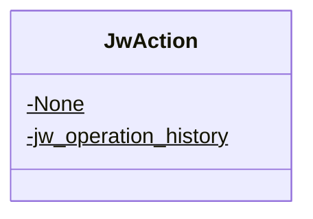

<div id="AutofacHelper-class-diagram"></div>

##### `AutofacHelper` class diagram

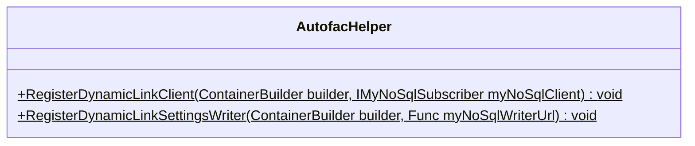

<div id="ActionEnum-class-diagram"></div>

##### `ActionEnum` class diagram

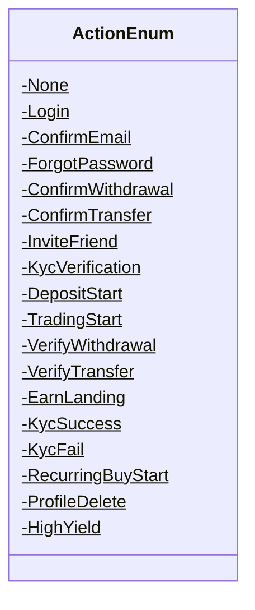

<div id="DeviceTypeEnum-class-diagram"></div>

##### `DeviceTypeEnum` class diagram

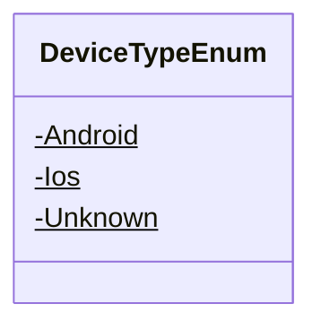

<div id="GenerateConfirmEmailLinkRequest-class-diagram"></div>

##### `GenerateConfirmEmailLinkRequest` class diagram

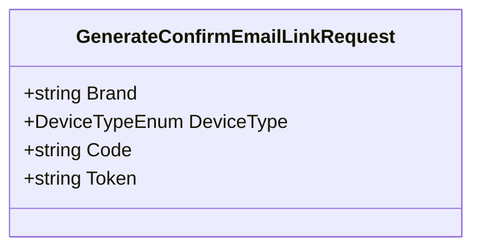

<div id="GenerateDeleteProfileLinkRequest-class-diagram"></div>

##### `GenerateDeleteProfileLinkRequest` class diagram

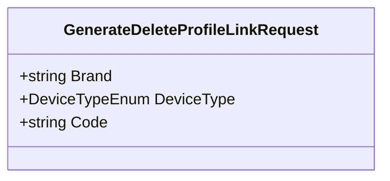

<div id="GenerateDepositStartLinkRequest-class-diagram"></div>

##### `GenerateDepositStartLinkRequest` class diagram

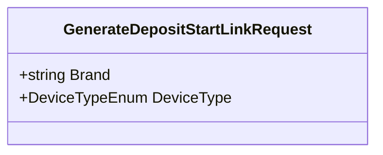

<div id="GenerateEarnLandingLinkRequest-class-diagram"></div>

##### `GenerateEarnLandingLinkRequest` class diagram

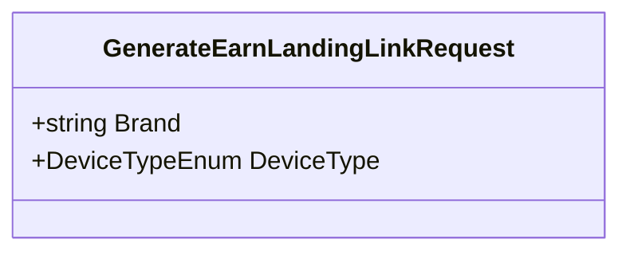

<div id="GenerateForgotPasswordLinkRequest-class-diagram"></div>

##### `GenerateForgotPasswordLinkRequest` class diagram

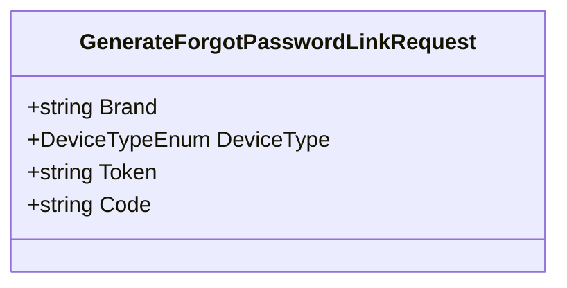

<div id="GenerateHighYieldLinkRequest-class-diagram"></div>

##### `GenerateHighYieldLinkRequest` class diagram

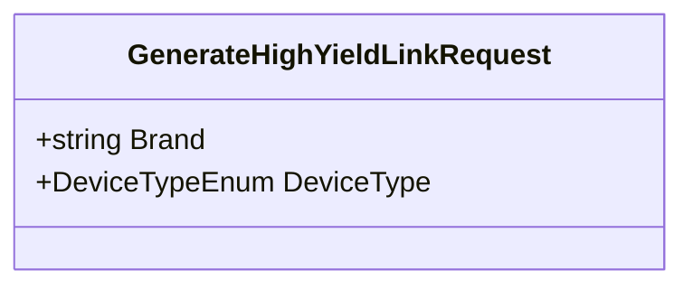

<div id="GenerateInviteFriendLinkRequest-class-diagram"></div>

##### `GenerateInviteFriendLinkRequest` class diagram

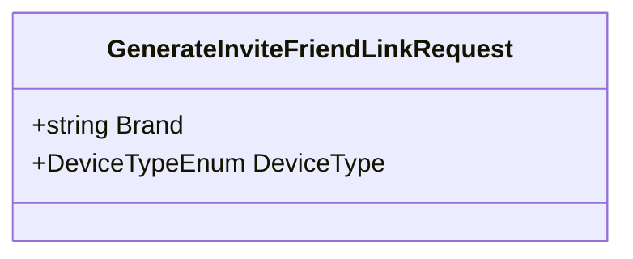

<div id="GenerateKycFailLinkRequest-class-diagram"></div>

##### `GenerateKycFailLinkRequest` class diagram

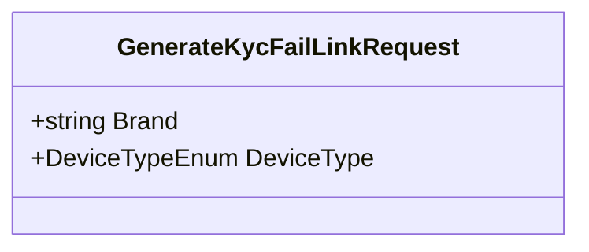

<div id="GenerateKycSuccessLinkRequest-class-diagram"></div>

##### `GenerateKycSuccessLinkRequest` class diagram

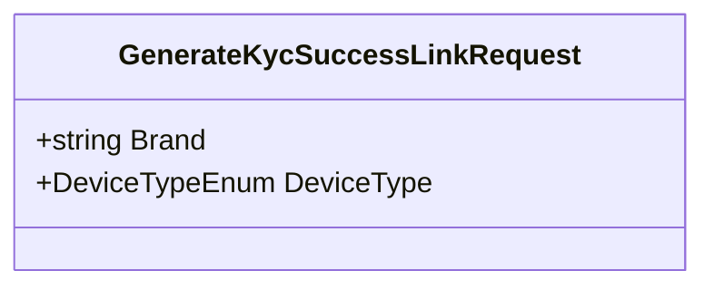

<div id="GenerateKycVerificationLinkRequest-class-diagram"></div>

##### `GenerateKycVerificationLinkRequest` class diagram

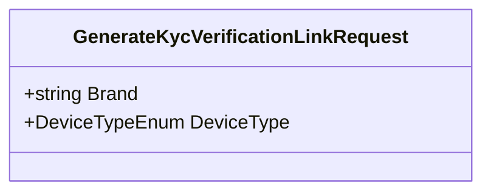

<div id="GenerateLoginLinkRequest-class-diagram"></div>

##### `GenerateLoginLinkRequest` class diagram

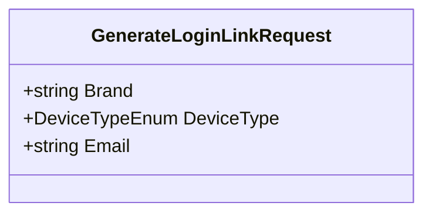

<div id="GenerateRecurringBuyLinkRequest-class-diagram"></div>

##### `GenerateRecurringBuyLinkRequest` class diagram

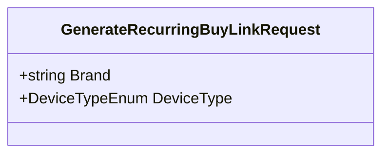

<div id="GenerateTradingStartLinkRequest-class-diagram"></div>

##### `GenerateTradingStartLinkRequest` class diagram

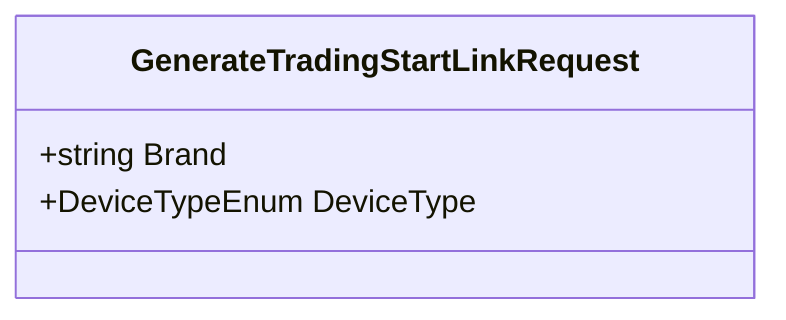

<div id="GenerateTransferLinkRequest-class-diagram"></div>

##### `GenerateTransferLinkRequest` class diagram

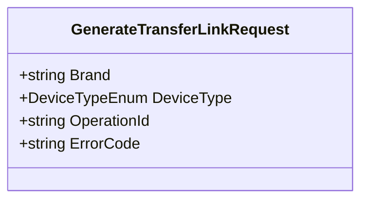

<div id="GenerateVerifyTransferLinkRequest-class-diagram"></div>

##### `GenerateVerifyTransferLinkRequest` class diagram

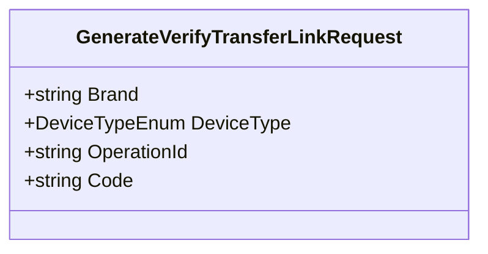

<div id="GenerateVerifyWithdrawalLinkRequest-class-diagram"></div>

##### `GenerateVerifyWithdrawalLinkRequest` class diagram

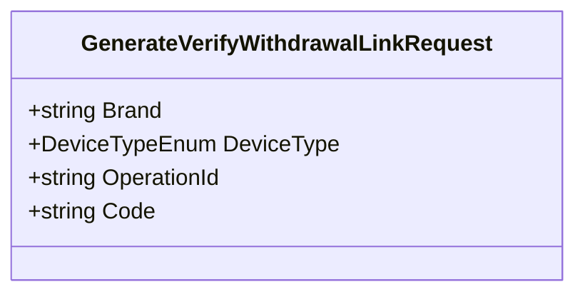

<div id="GenerateWithdrawalLinkRequest-class-diagram"></div>

##### `GenerateWithdrawalLinkRequest` class diagram

```mermaid
classDiagram
class GenerateWithdrawalLinkRequest{
    +string Brand
    +DeviceTypeEnum DeviceType
    +string OperationId
    +string ErrorCode
}

```

<div id="DynamicLinkSettingsNoSql.BaseLinks-class-diagram"></div>

##### `DynamicLinkSettingsNoSql.BaseLinks` class diagram

```mermaid
classDiagram
class BaseLinks{
    +string BaseLinkDefault
    +string BaseLinkIos
    +string BaseLinkAndroid
}

```

<div id="DynamicLinkSettingsNoSql-class-diagram"></div>

##### `DynamicLinkSettingsNoSql` class diagram

```mermaid
classDiagram
class DynamicLinkSettingsNoSql{
    -string TableName$
    +string DomainUriPrefix
    +string AndroidPackageName
    +string IosBundleId
    +string IosStoreId
    +Dictionary<ActionEnum, BaseLinks> LinksMap
    +GeneratePartitionKey()$ string
    +GenerateRowKey(string brand)$ string
    +Create(string brand, string domainUriPrefix, string androidPackageName, string iosBundleId, Dictionary<ActionEnum, BaseLinks> linksMap)$ DynamicLinkSettingsNoSql
}

```

<div id="ActionUrlClient-class-diagram"></div>

##### `ActionUrlClient` class diagram

```mermaid
classDiagram
class ActionUrlClient{
    +GenerateOperationHistoryUrl(string baseUrl, string operationId)$ string
}

```

<div id="DynamicLinkClient-class-diagram"></div>

##### `DynamicLinkClient` class diagram

```mermaid
classDiagram
IDynamicLinkClient <|-- DynamicLinkClient : implements
class DynamicLinkClient{
    -IMyNoSqlServerDataReader<DynamicLinkSettingsNoSql> _reader
    +.ctor(IMyNoSqlServerDataReader<DynamicLinkSettingsNoSql> reader) DynamicLinkClient
    +GenerateLoginLink(GenerateLoginLinkRequest request) (string longLink, string shortLink)
    +GenerateConfirmEmailLink(GenerateConfirmEmailLinkRequest request) (string longLink, string shortLink)
    +GenerateForgotPasswordLink(GenerateForgotPasswordLinkRequest request) (string longLink, string shortLink)
    +GenerateConfirmedWithdrawalLink(GenerateWithdrawalLinkRequest request) (string longLink, string shortLink)
    +GenerateConfirmedTransferLink(GenerateTransferLinkRequest request) (string longLink, string shortLink)
    +GenerateInviteFriendLink(GenerateInviteFriendLinkRequest request) (string longLink, string shortLink)
    +GenerateKycVerificationLink(GenerateKycVerificationLinkRequest request) (string longLink, string shortLink)
    +GenerateDepositStartLink(GenerateDepositStartLinkRequest request) (string longLink, string shortLink)
    +GenerateTradingStartLink(GenerateTradingStartLinkRequest request) (string longLink, string shortLink)
    +GenerateVerifyWithdrawalLink(GenerateVerifyWithdrawalLinkRequest request) (string longLink, string shortLink)
    +GenerateVerifyTransferLink(GenerateVerifyTransferLinkRequest request) (string longLink, string shortLink)
    +GenerateEarnLandingLink(GenerateEarnLandingLinkRequest request) (string longLink, string shortLink)
    +GenerateKycSuccessLink(GenerateKycSuccessLinkRequest request) (string longLink, string shortLink)
    +GenerateKycFailLink(GenerateKycFailLinkRequest request) (string longLink, string shortLink)
    +GenerateRecurringBuyLink(GenerateRecurringBuyLinkRequest request) (string longLink, string shortLink)
    +GenerateProfileDeleteLink(GenerateDeleteProfileLinkRequest request) (string longLink, string shortLink)
    +GenerateHighYieldLink(GenerateHighYieldLinkRequest request) (string longLink, string shortLink)
    +GenerateDeepLink(ActionEnum action, DeviceTypeEnum device, string brand, string paramString) (string longLink, string shortLink)
}

```

<div id="IDynamicLinkClient-class-diagram"></div>

##### `IDynamicLinkClient` class diagram

```mermaid
classDiagram
class IDynamicLinkClient{
    +GenerateLoginLink(GenerateLoginLinkRequest request)* (string longLink, string shortLink)
    +GenerateConfirmEmailLink(GenerateConfirmEmailLinkRequest request)* (string longLink, string shortLink)
    +GenerateForgotPasswordLink(GenerateForgotPasswordLinkRequest request)* (string longLink, string shortLink)
    +GenerateConfirmedWithdrawalLink(GenerateWithdrawalLinkRequest request)* (string longLink, string shortLink)
    +GenerateConfirmedTransferLink(GenerateTransferLinkRequest request)* (string longLink, string shortLink)
    +GenerateInviteFriendLink(GenerateInviteFriendLinkRequest request)* (string longLink, string shortLink)
    +GenerateKycVerificationLink(GenerateKycVerificationLinkRequest request)* (string longLink, string shortLink)
    +GenerateDepositStartLink(GenerateDepositStartLinkRequest request)* (string longLink, string shortLink)
    +GenerateTradingStartLink(GenerateTradingStartLinkRequest request)* (string longLink, string shortLink)
    +GenerateVerifyWithdrawalLink(GenerateVerifyWithdrawalLinkRequest request)* (string longLink, string shortLink)
    +GenerateVerifyTransferLink(GenerateVerifyTransferLinkRequest request)* (string longLink, string shortLink)
    +GenerateEarnLandingLink(GenerateEarnLandingLinkRequest request)* (string longLink, string shortLink)
    +GenerateKycSuccessLink(GenerateKycSuccessLinkRequest request)* (string longLink, string shortLink)
    +GenerateKycFailLink(GenerateKycFailLinkRequest request)* (string longLink, string shortLink)
    +GenerateRecurringBuyLink(GenerateRecurringBuyLinkRequest request)* (string longLink, string shortLink)
    +GenerateProfileDeleteLink(GenerateDeleteProfileLinkRequest request)* (string longLink, string shortLink)
    +GenerateHighYieldLink(GenerateHighYieldLinkRequest request)* (string longLink, string shortLink)
}

```

<div id="Program-class-diagram"></div>

##### `Program` class diagram

```mermaid
classDiagram
class Program{
    +Main(string[] args)$ void
}

```

*This file is maintained by a bot.*

<!-- markdownlint-restore -->
